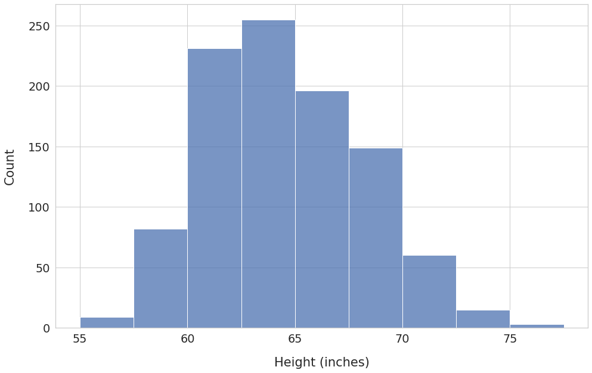
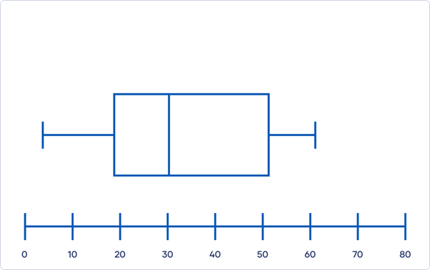
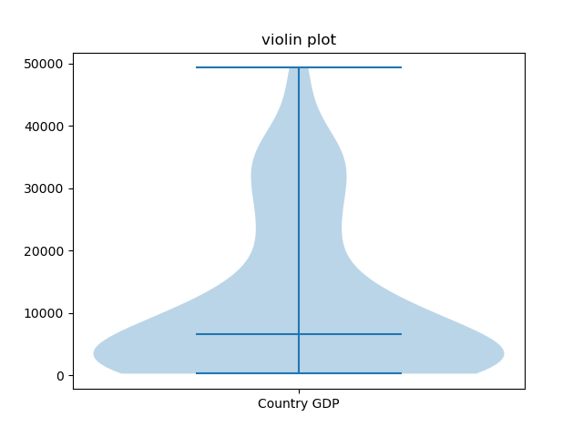
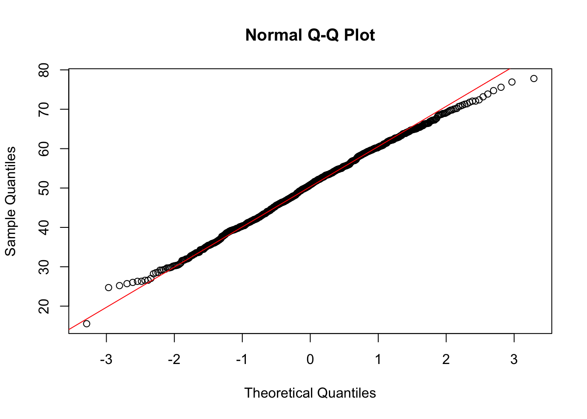

## What We've Been Doing

- Extracting **continuous construct scores** from text
  - Dictionary-based: raw frequencies, normalized ratios
  - Embedding-based: cosine similarities (DDR, CCR)
- Result: a **number per document** representing a construct (e.g., political ideology, sentiment, hostility)

::: fragment
> You've extracted **ideological leaning scores** (via DDR cosine similarity) for 500 political speeches.  
> Each speech is tagged with: speaker party, year, country.

> What are the effects of ideology on variable y?

> How do the variables x and z impact the scores?
:::

- How do we test hypotheses *with* those scores?

---

## The Big Picture

::: fragment
Two types of statistics:
:::

- **Descriptive** — What does my data look like?
- **Inferential** — Is there a real pattern, or just noise?


## Start with descriptives

- Before testing anything: **understand your data**
- Catch errors, outliers, weird distributions
- Required for any publication or report
- CS instinct: just run the model → often a mistake

---

## Central Tendency

::: fragment
| Measure | When to use |
|--------|-------------|
| **Mean** | Symmetric distributions, no extreme outliers |
| **Median** | Skewed distributions, robust to outliers |
| **Mode** | Categorical or heavily discrete data |
:::

::: fragment
1, 1, 1, 3, 5, 6, 6, 7, 90
:::


---

## Spread & Variability

- **Standard Deviation (SD):** average distance from the mean
- **Variance:** SD² — less interpretable, used in formulas
- **IQR:** range of the middle 50% — robust
- **Standard Error (SE):** how uncertain is our *mean estimate*?

::: fragment
$$SE = \frac{SD}{\sqrt{n}}$$

SE shrinks as *n* grows → more data = more confidence
:::


## Visualizing Your Distribution

::: {.fragment}
- **Histogram** — shape of the data
{height=400px}
:::
::: {.fragment}
- **Boxplot** — median, IQR, outliers at a glance
{height=400px}
:::
::: {.fragment}
- **Violin plot** — boxplot + density
{height=400px}
:::
::: {.fragment}
- **Q-Q plot** — is it normally distributed?
{height=400px}
:::


::: fragment
::: {.callout-tip}
Always plot before you test. A number alone can hide a bimodal distribution.
:::
:::


## Checking Normality

- Many tests assume **normality**
- Q-Q plot: points should fall on the diagonal
- **Shapiro-Wilk test** (formal): `shapiro.test(x)`
  - p > .05 → no strong evidence of non-normality
  - With large n, it's very sensitive — use plots too

- **Skewness** (asymmetry) and **kurtosis** (tail weight) are also informative

---


## The Logic of Hypothesis Testing

1. Formulate **H₀** (null) and **H₁** (alternative)
2. Assume H₀ is true
3. Calculate: *how likely is my data (or more extreme) under H₀?*
4. That probability = **p-value**
5. If p < .05 → reject H₀

::: fragment
> H₀: "Left and right parties have the same mean ideology score"  
> H₁: "Left and right parties differ in terms of mean ideology score"
:::


## p-values: Common Misconceptions

- p < .05 does **not** mean H₁ is true
- p-value is **not** the probability that H₀ is true
- p < .05 with n = 100,000 can be a trivially small effect

::: fragment
::: {.callout-warning}
Always pair p-values with **effect sizes** and **confidence intervals**
:::
:::


## Effect Sizes

Statistical significance ≠ practical importance.

::: fragment
| Effect | Cohen's d | Pearson's r | R² |
|--------|-----------|-------------|-----|
| Small  | 0.2       | .10         | .01 |
| Medium | 0.5       | .30         | .09 |
| Large  | 0.8       | .50         | .25 |
:::

- Always report an effect size alongside your p-value
- A tiny but "significant" effect may not matter

---

## Confidence Intervals

- A **95% CI** contains the true parameter in 95% of repeated samples
- Narrower CI → more precise estimate
- CIs that don't cross 0 ≈ statistically significant

::: fragment
Example: Mean ideology score for left parties = 0.42 [0.38, 0.46]

`t.test(x)$conf.int`
:::


## Comparing groups: The t-test

- Compares **two group means**
- Are ideology scores different for left vs. right party speeches?

::: fragment
Two types:

- **Independent samples** — two different groups

- **Paired** — same unit measured twice (e.g., pre/post election)

- `t.test(score ~ party, data = df, paired = FALSE)`
:::

- Reports: t-statistic, df, p-value, 95% CI
- Effect size: **Cohen's d** (use `effectsize` package)

---

## t-test assumptions

1. Observations are **independent**
2. Outcome is approximately **normally distributed** within groups
3. **Equal variances** (Welch's t-test relaxes this — R default)

::: fragment
If assumptions fail → use **Mann-Whitney U** (non-parametric):  
`wilcox.test(score ~ party, data = df)`
:::

## ANOVA: Three or More Groups

- Extension of t-test to **k groups**
- E.g., comparing ideology scores across 4 parties

::: fragment
`aov(score ~ party, data = df)`  
then `summary()` and post-hoc: `TukeyHSD()`
:::

- F-statistic: ratio of between-group to within-group variance
- Effect size: **η²** (eta-squared)
- If F is significant → which pairs differ? → post-hoc tests

---

## ANOVA Assumptions & Alternatives

- Independence
- Normality within groups
- Homogeneity of variance (`leveneTest()`)

::: fragment
Non-parametric alternative: **Kruskal-Wallis**  
`kruskal.test(score ~ party, data = df)`
:::

## Correlation: A First Look at Relationships

Two continuous variables? Start with **correlation**:

- **Pearson's r** — linear relationship, assumes normality
  - r = 0 → no linear relationship; r = ±1 → perfect
- **Spearman's ρ** — rank-based, robust to outliers and non-normality

::: fragment
Example: Does ideology score correlate with speech length? With year?

`cor.test(x, y, method = "pearson")`
:::


## Regression

- t-test / ANOVA: categorical predictor only
- correlation: strength of relationship (no magnitude)
- Regression: **any type of predictor**, multiple at once
- Gives you **direction + magnitude** of effects, not just "is there an effect"

::: fragment
> Does ideology score predict vote share?  
> Does it, *controlling for* country and year?
:::


## Simple Linear Regression

$$Y = \beta_0 + \beta_1 X + \varepsilon$$

- **β₀** = intercept (predicted Y when X = 0)
- **β₁** = slope (change in Y for 1-unit increase in X)
- **ε** = residual error

::: fragment
`lm(vote_share ~ ideology_score, data = df)`
:::


## Interpreting Regression Output

```
Call: lm(formula = vote_share ~ ideology_score)

Coefficients:
               Estimate Std. Error t value Pr(>|t|)
(Intercept)      45.2       1.3    34.8   <.001 ***
ideology_score    8.4       1.1     7.6   <.001 ***

R-squared: 0.21
```

- Ideology score = +1 → +8.4 pp vote share
- R² = .21 → the model explains 21% of variance

---

## Multiple Regression

Add more predictors to **control for confounds**:

```r
lm(vote_share ~ ideology_score + year + country, data = df)
```

- Each β = effect *holding all other predictors constant*
- **Categorical predictors** → automatically dummy-coded
- Check for **multicollinearity** (VIF): `vif()` from `car`

---

## Regression Assumptions

1. **Linearity** — relationship is linear
2. **Independence** — residuals are not correlated
3. **Homoscedasticity** — constant variance of residuals
4. **Normality of residuals**

::: fragment
Diagnostics: `plot(model)` — four key plots  
Or: `check_model()` from `performance` package (cleaner output, but sometimes slow)
:::

---

## Model Comparison & Selection

- **More predictors ≠ better model**
- Prefer simpler models when fit is similar (parsimony)
- Compare with **AIC** (lower = better):  
  `AIC(model1, model2)`
- Or likelihood ratio test for nested models:  
  `anova(model1, model2)`

---

## Logistic Regression

- When your outcome is **binary** (e.g., incumbent won/lost)
- `glm(won ~ ideology_score, family = binomial)`
- Coefficients are on **log-odds** scale
- Exponentiate → **odds ratios**: `exp(coef(model))`

## Working with count data

- Many outcomes in NLP and social media research are **counts**:
  - Number of retweets, shares, comments
  - Word or dictionary term frequencies per document
  - Number of speeches per speaker per year
- These are **not normally distributed** — they are discrete, non-negative, and often right-skewed with many zeros

::: fragment
::: {.callout-warning}
Using `lm()` on count data violates the normality and homoscedasticity assumptions — predictions can even go negative
:::
:::

::: fragment
The solution: **Generalized Linear Models (GLMs)** with the right family
:::

---

## Poisson and Negative Binomial Regression

::: fragment
**Poisson** — the baseline model for counts:

- Assumes mean = variance
- `glm(count ~ x, family = poisson)`
:::

::: fragment
**Negative Binomial** — when counts are overdispersed (variance > mean), which is almost always the case with real social media data:

- `library(MASS)`
- `glm.nb(count ~ x, data = df)`
:::

::: fragment
| Outcome | Model |
|---------|-------|
| Binary (yes/no) | Logistic regression |
| Count, mean ≈ variance | Poisson |
| Count, variance >> mean | Negative Binomial |
| Continuous, normal | Linear regression |
:::

::: fragment
::: {.callout-tip}
When in doubt between Poisson and NB, fit both and compare with `AIC()` — lower wins
:::
:::

---

## The Problem: Clustered Data

Typical in our setting:

- Multiple speeches per **speaker**
- Multiple texts per **document source**
- Speeches nested within **countries**

::: fragment
Standard regression assumes **independence** — violated here!  
Ignoring clustering → inflated false positives
:::

---

## Fixed vs. Random Effects

| | Fixed Effects | Random Effects |
|-|--------------|----------------|
| What | Variables you care about | Sources of clustering |
| Estimated | Yes, with coefficients | As variance components |
| Example | Party, year, ideology score | Speaker ID, country |

::: fragment
> "Does ideology score predict vote share, accounting for the fact that speeches come from the same politicians?"
:::


## The Mixed-Effects Model

```r
library(lme4)

lmer(vote_share ~ ideology_score + year + (1 | speaker_id), 
     data = df)
```

- `(1 | speaker_id)` = random intercept per speaker
- Each speaker gets their "own" baseline, then fixed effects are estimated on top
- If speakers vary in slope too: `(1 + ideology_score | speaker_id)`

---

## Random Intercepts vs. Random Slopes

- **Random intercept:** each unit has its own average level  
  → speakers differ in baseline vote share
- **Random slope:** each unit has its own relationship with a predictor  
  → ideology matters more for some politicians than others

::: fragment
Start with random intercepts. Add slopes only if theoretically motivated.
:::

---

## When Do You Need Mixed Effects?

Ask yourself:

- Is my data **grouped** (speakers, documents, countries)?
- Do I have **repeated observations** from the same unit?
- Would a simpler model violate independence?

::: fragment
If yes → mixed-effects model is safer
:::

::: fragment
*Even when n per group is small*, random effects can help partial pooling.

*But* make sure you have enough groups.
:::


## A Typical Analysis Pipeline

1. Extract scores (DDR/CCR cosine similarity)
2. Describe: mean, SD, distribution plots per group
3. Check normality (Q-Q plot, Shapiro-Wilk)
4. Are there groups? → t-test / ANOVA
5. Continuous predictor? → Regression
6. Clustered data? → Mixed-effects model
7. Report: estimate + SE + p-value + effect size + CI

---

## Which Test Do I Use?

| Situation | Test |
|----------|------|
| Compare 2 group means | t-test |
| Compare 3+ group means | ANOVA |
| One continuous predictor | Linear regression |
| Multiple predictors | Multiple regression |
| Grouped/clustered data | Mixed-effects model |
| Non-normal data, small n | Non-parametric alternatives |

## What to Always Report

| Element | Why |
|---------|-----|
| Descriptives (M, SD) | Reader can evaluate the data |
| Effect size | Separates significance from importance |
| Confidence interval | Shows precision of estimate |
| Model assumptions | Reader can trust the test |
| Sample size | Power and generalizability |

---

## Common Mistakes

- Running tests without checking assumptions
- Reporting p-values without effect sizes
- Ignoring clustering (multiple texts per author)
- Overfitting: too many predictors for your n
- Multicollinearity: including correlated predictors

---

## Recommended Packages (R)

| Task | Package |
|------|---------|
| Descriptives | `psych`, `skimr` |
| Visualization | `ggplot2` |
| Normality | `stats` (built-in) |
| t-test / ANOVA | `stats`, `car` |
| Regression | `stats`, `performance` |
| Mixed models | `lme4`, `lmerTest` |
| Effect sizes | `effectsize`, `MuMIn` |


