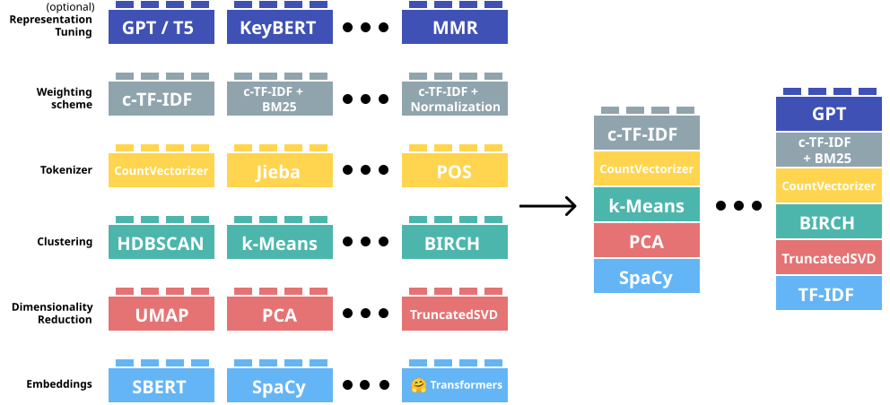

## What is topic modelling?

::: fragment
(Mostly) Unsupervised machine learning methods that discover latent thematic structure (i.e., topics) in a corpus of documents.
:::

::: fragment
Two main families:

-   Probabilistic topic models — discover topics through patterns of word co-occurrence

-   Embedding-based topic models — discover topics through semantic similarity in vector space
:::

:::: fragment
::: callout-warning
Topic models are exploratory, not confirmatory: they suggest patterns, the researcher must interpret them
:::
::::

## The probabilistic intuition

-   If a document is about a particular subject, words associated with that subject will appear more often in it than in documents about other subjects.

-   LDA works backwards: it starts from the words to reconstruct the topics.

-   Documents are mixtures of topics: a presidential speech can be 60% economy, 30% foreign policy, 10% military.

::: fragment
Two key outputs:

-   β (beta): which words characterise each topic? (army, navy, war → military topic)

-   θ (theta): how much does each document engage with each topic?
:::

## Key assumptions

-   The corpus contains enough documents for reliable co-occurrence patterns

-   Each document has mixed membership — it can belong to multiple topics simultaneously in different proportions (≠ hard clustering)

-   The corpus is structured by a finite number K of latent topics (K must be specified in advance)

-   Bag-of-words: word order, syntax, and context are discarded

## LDA and variants

-   Foundational algorithm^1^; all subsequent approaches build on or extend it

-   Fully unsupervised: only input from the researcher is K (number of topics)

-   Seeded LDA: researcher provides seed terms to anchor specific topics (e.g. *army, war, navy* → military)

    — results are more stable and interpretable, but seeds = bias

-   Supervised LDA (sLDA): uses document-level labels (e.g. ratings, scores) to make topics *predictive* of an outcome

    — less common in humanities

-   Structural topic modelling (STM): topic content can vary with covariates

    -   meaningful metadata required

## Caveats of LDA

-   The K problem: number of topics must be set in advance; empirical metrics can guide the choice but human judgment is always needed

-   Pre-processing matters: stopword lists, stemming, and minimum frequency thresholds all substantially affect results — document your choices

-   Topics may be uninterpretable: some topics capture noise, style, or corpus artefacts rather than genuine themes — always validate qualitatively

-   Bag-of-words blindness: word order, negation, and context are discarded ("war is not the answer" = "the answer is war")

## Embedding-based topic modelling

-   Move beyond bag-of-words

-   Use semantic embeddings (context-aware)

-   Similar documents → close in vector space

-   Topics = clusters of semantically similar texts

## BERTopic pipeline

1.  Extract embeddings (e.g., SBERT)

2.  Reduce dimensionality (e.g., UMAP)

3.  Clustering embeddings (e.g., HDBSCAN)

4.  Tokenize for topic representation (e.g., CountVectorizer)

5.  Weigh words based on clusters (e.g., c-TF-IDF)

6.  Topic representation tuning (e.g., KeyBERT)

## 

## Output

-   Topic clusters (documents grouped together)

-   Top words per topic (from representation step)

-   Topic probabilities per document (soft assignment through HDBSCAN)

-   Outliers (documents not assigned to any topic)

## Advantages over LDA

-   Captures semantic similarity (car ≈ automobile)

-   Works well on short texts

-   No need to predefine K

-   Often more coherent topics

## Limitations

-   Computational costs

-   Many tuning choices (embedding, clustering, etc.)

-   Outliers are often the majority

## References

::: nonincremental
1.  Blei, David M., Andrew Y. Ng, and Michael I. Jordan. 2003. “Latent Dirichlet Allocation.” Journal of Machine Learning Research 3: 993–1022. https://doi.org/https://doi.org/10.5555/944919.944937.

2.  Grootendorst, M. (2022). BERTopic: Neural topic modeling with a class-based TF-IDF procedure. arXiv preprint arXiv:2203.05794.

3.  Roberts, M. E., Stewart, B. M., & Tingley, D. (2019). stm: An R Package for Structural Topic Models. Journal of Statistical Software, 91(2), 1–40. https://doi.org/10.18637/jss.v091.i02
:::
